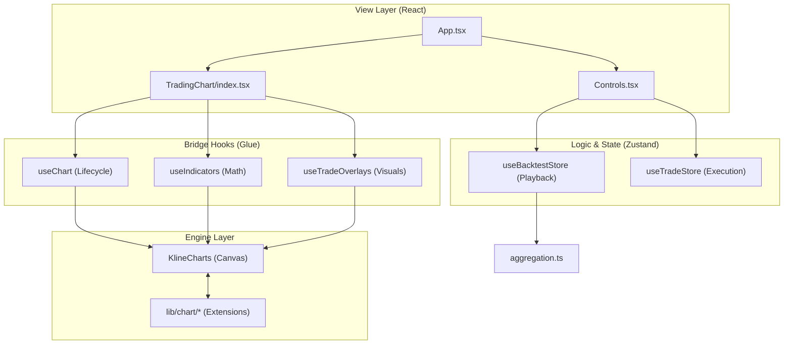

# OpenBackTest Codebase Guide

*AI Generated Documentation*

This document provides a comprehensive overview of the OpenBackTest project structure. It is intended to help developers and AI agents navigate the codebase efficiently.

---

## Architecture Overview

OpenBackTest is a high-performance trading backtesting utility built with **React** and **Vite**.

- **Charting Engine**: [KlineCharts](https://klinecharts.com/) is used for high-performance financial charting.
- **State Management**: [Zustand](https://github.com/pmndrs/zustand) handles global application state, split into backtest playback and trading simulation.
- **Styling**: Modern, dark-themed UI built with custom CSS utilities and `lucide-react` icons.

### Entry Points
- [main.tsx](/src/main.tsx): React application root.
- [App.tsx](/src/App.tsx): Main layout container.

---

### Architectural Approach
The codebase follows a **Decoupled Bridge Architecture**:
1.  **State (Pure)**: Stores handle raw data and math (PnL, aggregation). They are chart-agnostic.
2.  **View (Declarative)**: React components manage layout and user input.
3.  **Hooks (The Bridge)**: These "watch" the State and imperatively update the Chart Engine (`chart.applyNewData()`, `chart.createOverlay()`).
4.  **Engine (Imperative)**: KlineCharts handles high-performance Canvas rendering via extensions in `lib/chart/`.
---

## Directory Structure

### `src/components`
UI components categorized by functional area.
- **`TradingChart/`**: All components related to the chart interface (overlays, menus, legends).
- **`Controls.tsx`**: Top navigation and data loading controls.
- **`PlaybackBar.tsx`**: The bottom timeline and playback controls.
- **`TradingPanel.tsx`**: The right-side panel for trade execution and account status.

### `src/hooks`
Custom React hooks encapsulating complex logic.
- **`useChart.ts`**: Lifecycle management for the KlineCharts instance.
- **`useIndicators.ts`**: Logic for adding, removing, and managing technical indicators.
- **`useTradeOverlays.ts`**: Rendering logic for TP/SL lines and trade entry areas.
- **`useContextMenu.ts`**: Logic for the chart's right-click interaction.

### `src/store`
Zustand stores defining the global state and actions.
- **`useBacktestStore.ts`**: Controls data playback (Play/Pause/Step), symbol selection, and timeframe management.
- **`useTradeStore.ts`**: Core trading engine. Manages positions, orders, PnL calculations, and trade history.

### `src/lib/chart`
Low-level extensions for KlineCharts.
- **`customIndicators.ts`**: Definitions for complex indicators like Volume Profile (VPVR).
- **`overlays.ts`**: Registration of custom visual elements (e.g., TP/SL lines).
- **`constants.ts`**: Shared IDs and configuration constants for the chart.

### `src/types`
- **`index.ts`**: Shared TypeScript interfaces for Candles, Trades, and Timeframes.
- **`indicatorTypes.ts`**: Types specific to indicator configurations.

---

## File Manifest

| File | Responsibility |
| :--- | :--- |
| `src/App.tsx` | Main application shell and layout. |
| `src/hooks/useChart.ts` | Initializes chart, handles data updates, and manages responsive resizing. |
| `src/store/useBacktestStore.ts` | Centralizes data state; includes `stepForward`, `togglePlayback`, and `loadData`. |
| `src/store/useTradeStore.ts` | Executes `buy`, `sell`, and `flat` orders; tracks account equity and leverage. |
| `src/lib/chart/customIndicators.ts` | Mathematical logic for indicators not natively supported by KlineCharts. |
| `src/components/TradingChart/ContextMenu.tsx` | UI for the right-click menu (Set TP/SL, Reset View). |
| `src/components/TradingChart/DrawingToolbar.tsx` | Left-side sidebar for chart annotation tools (Lines, Measures). |
| `src/hooks/useIndicators.ts` | Bridges the store state to the KlineCharts indicator API. |
| `src/utils/aggregation.ts` | Logic to convert 1m raw data into higher timeframes (5m, 1h, etc.). |

---

## Developer & Agent Guide

### Common Tasks
- **Adding a New Indicator**:
  1. Define logic in `src/lib/chart/customIndicators.ts`.
  2. Add the indicator name to `INDICATORS_LIST` in `src/hooks/useIndicators.ts`.
- **Modifying Trading Logic**:
  - Edit `src/store/useTradeStore.ts` for execution logic.
  - Edit `src/hooks/useTradeOverlays.ts` to change how positions look on the chart.
- **Updating UI Theme**:
  - Global styles are in `src/index.css`.
  - Component-specific styles are often inline or in `App.css`.

### Search Keywords
- `KlineCharts`: For chart API questions.
- `Zustand`: For state management patterns.
- `VPVR`: For Volume Profile logic.
- `useBacktestStore`: For playback control.

### State Flow
1. **Data Source**: CSV/JSON loaded into `useBacktestStore`.
2. **Aggregation**: `useBacktestStore` uses `aggregation.ts` to prepare data for the current timeframe.
3. **Rendering**: `useChart` detects data changes and calls `chart.applyNewData()`.
4. **Interaction**: User actions trigger `useTradeStore`, which updates overlays via `useTradeOverlays`.

## Architecture Mapping

