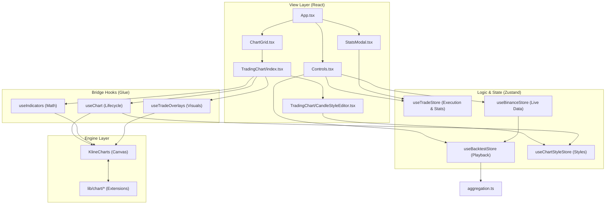

# OpenBackTest Codebase Guide

*AI Generated Documentation*

This document provides a comprehensive overview of the OpenBackTest project structure. It is intended to help developers and AI agents navigate the codebase efficiently.

---

## Architecture Overview

OpenBackTest is a high-performance trading backtesting utility built with **React** and **Vite**.

- **Charting Engine**: [KlineCharts](https://klinecharts.com/) is used for high-performance financial charting.
- **State Management**: [Zustand](https://github.com/pmndrs/zustand) handles global application state, split into backtest playback and trading simulation.
- **Styling**: Modern, dark-themed UI built with custom CSS utilities and `lucide-react` icons.

### Entry Points
- [main.tsx](/src/main.tsx): React application root.
- [App.tsx](/src/App.tsx): Main layout container.

---

### Architectural Approach
The codebase follows a **Decoupled Bridge Architecture**:
1.  **State (Pure)**: Stores handle raw data and math (PnL, aggregation). They are chart-agnostic.
2.  **View (Declarative)**: React components manage layout and user input.
3.  **Hooks (The Bridge)**: These "watch" the State and imperatively update the Chart Engine (`chart.applyNewData()`, `chart.createOverlay()`).
4.  **Engine (Imperative)**: KlineCharts handles high-performance Canvas rendering via extensions in `lib/chart/`.
---

## Directory Structure

### `src/components`
UI components categorized by functional area.
- **`ChartGrid.tsx`**: Dynamic, resizable grid layout using `react-resizable-panels` to display up to 3 charts simultaneously.
- **`TradingChart/`**: All components related to the chart interface (overlays, menus, legends, individual chart containers).
- **`Controls.tsx`**: Top navigation, data loading controls, and session import/export management.
- **`PlaybackBar.tsx`**: The bottom timeline and playback controls.
- **`TradingPanel.tsx`**: The right-side panel for trade execution and account status.
- **`StatsModal.tsx`**: Performance analysis dashboard with equity curve and export features.

### `src/hooks`
Custom React hooks encapsulating complex logic.
- **`useChart.ts`**: Lifecycle management for the KlineCharts instance.
- **`useIndicators.ts`**: Logic for adding, removing, and managing technical indicators.
- **`useTradeOverlays.ts`**: Rendering logic for TP/SL lines and trade entry areas.
- **`useContextMenu.ts`**: Logic for the chart's right-click interaction.

### `src/store`
Zustand stores defining the global state and actions.
- **`useBacktestStore.ts`**: Controls data playback (Play/Pause/Step), symbol selection, and multi-chart state management (array of `ChartConfig`).
- **`useTradeStore.ts`**: Core trading engine. Manages positions, orders, PnL calculations, trade history, and session statistics.
- **`useChartStyleStore.ts`**: Manages styling properties for the chart, such as bullish/bearish candle colors, and persists user settings in localStorage.

### `src/lib/chart`
Low-level extensions for KlineCharts.
- **`customIndicators.ts`**: Definitions for complex indicators like Volume Profile (VPVR).
- **`overlays.ts`**: Registration of custom visual elements (e.g., TP/SL lines).
- **`constants.ts`**: Shared IDs and configuration constants for the chart.

### `src/types`
- **`index.ts`**: Shared TypeScript interfaces for Candles, Trades, and Timeframes.
- **`indicatorTypes.ts`**: Types specific to indicator configurations.

---

## File Manifest

| File | Responsibility |
| :--- | :--- |
| `src/App.tsx` | Main application shell and layout. Hosts the `ChartGrid`. |
| `src/components/ChartGrid.tsx` | Manages the resizable split-pane layout for multiple charts. |
| `src/hooks/useChart.ts` | Initializes chart, handles data updates, and manages responsive resizing with isolated container IDs. |
| `src/store/useBacktestStore.ts` | Centralizes data state; includes `stepForward`, `togglePlayback`, `loadData`, `updateLiveCandle`, and multi-chart configurations. |
| `src/store/useTradeStore.ts` | Executes trades; tracks account equity, leverage, and aggregates positions for statistics. |
| `src/store/useBinanceStore.ts` | Manages Binance Futures connection state, symbols, and live polling. |
| `src/store/useChartStyleStore.ts` | Central store managing persistent chart styles and styling properties. |
| `src/components/TradingChart/CandleStyleEditor.tsx` | Floating overlay editor for bullish/bearish candle, border, and wick colors. |
| `src/components/StatsModal.tsx` | Calculates and displays Win Rate, Profit Factor, R/R, and Equity Curve; handles CSV exports. |
| `src/lib/chart/customIndicators.ts` | Mathematical logic for indicators not natively supported by KlineCharts. |
| `src/components/TradingChart/ContextMenu.tsx` | UI for the right-click menu (Set TP/SL, Reset View). |
| `src/components/TradingChart/DrawingToolbar.tsx` | Left-side sidebar for chart annotation tools (Lines, Measures). |
| `src/hooks/useIndicators.ts` | Bridges the store state to the KlineCharts indicator API. |
| `src/utils/aggregation.ts` | Logic to convert 1m raw data into higher timeframes (5m, 1h, etc.). |
| `src/services/binance.ts` | Handles Binance API interactions (fetching symbols, historical klines, live polling). |

---

## Developer & Agent Guide

### Common Tasks
- **Adding a New Indicator**:
  1. Define logic in `src/lib/chart/customIndicators.ts`.
  2. Add the indicator name to `INDICATORS_LIST` in `src/hooks/useIndicators.ts`.
- **Modifying Trading Logic**:
  - Edit `src/store/useTradeStore.ts` for execution logic.
  - Edit `src/hooks/useTradeOverlays.ts` to change how positions look on the chart.
- **Adjusting Statistics & Reporting**:
  - Statistics are calculated in `src/components/StatsModal.tsx` using `finishedPositions` from the trade store.
  - To add new metrics, update the `Position` interface in `useTradeStore.ts` and the calculation logic in `StatsModal.tsx`.

### Search Keywords
- `KlineCharts`: For chart API questions.
- `Zustand`: For state management patterns.
- `VPVR`: For Volume Profile logic.
- `useBacktestStore`: For playback control.
- `StatsModal`: For performance metrics and reporting.

### Rules for AI Agents Contributing to this Project
When working on features, bug fixes, or enhancements, you MUST adhere to the following rules:
1. **Test Directory Structure**: All unit and integration tests MUST be placed in the root `tests/` directory (e.g., `tests/store`, `tests/components`, `tests/hooks`). **Do not** place `__tests__` folders or `.test.ts` files alongside the source code in the `src/` directory.
2. **Testing Stack**: The project uses `vitest`, `jsdom`, and `@testing-library/react`. 
3. **Mocking**: When writing tests for complex React hooks and Zustand stores (especially those interacting with the canvas or browser APIs), actively use `@testing-library/react`'s `renderHook` and `vitest`'s `vi.mock()`/`vi.spyOn()`.
4. **Coverage**: When adding new UI components or data stores, ensure that you provide corresponding test coverage. Run `npm run coverage` to verify your changes.

### State Flow
1. **Data Source**: CSV/JSON loaded into `useBacktestStore`.
2. **Aggregation**: `useBacktestStore` uses `aggregation.ts` to prepare data for the current timeframe.
3. **Rendering**: `useChart` detects data changes and calls `chart.applyNewData()`.
4. **Interaction**: User actions trigger `useTradeStore`, which updates overlays via `useTradeOverlays`.
5. **Completion**: When a simulation is finished, `useTradeStore` aggregates all trades into `finishedPositions` and triggers the `StatsModal`.

## Architecture Mapping


```mermaid
graph TD
    %% Layers
    subgraph UI ["View Layer (React)"]
        App["App.tsx"]
        Controls["Controls.tsx"]
        ChartGrid["ChartGrid.tsx"]
        ChartUI["TradingChart/index.tsx"]
        CandleEditor["TradingChart/CandleStyleEditor.tsx"]
        Stats["StatsModal.tsx"]
    end

    subgraph Logic ["Logic & State (Zustand)"]
        BS["useBacktestStore (Playback)"]
        TS["useTradeStore (Execution & Stats)"]
        CSS["useChartStyleStore (Styles)"]
        BNS["useBinanceStore (Live Data)"]
    end

    subgraph Bridge ["Bridge Hooks (Glue)"]
        UC["useChart (Lifecycle)"]
        UIH["useIndicators (Math)"]
        UT["useTradeOverlays (Visuals)"]
    end

    subgraph Engine ["Engine Layer"]
        KC["KlineCharts (Canvas)"]
        Lib["lib/chart/* (Extensions)"]
    end

    %% Mapping
    App --> Controls & ChartGrid & Stats
    ChartGrid --> ChartUI
    Controls --> BS & TS & BNS
    BNS --> BS
    ChartUI --> UC & UIH & UT & CandleEditor
    CandleEditor --> CSS
    Stats --> TS
    UC & UIH & UT --> KC
    UC --> CSS
    KC <--> Lib
    BS --> Agg["aggregation.ts"]
```

## External Data Integration

### Binance Futures Integration
OpenBackTest supports connecting directly to the Binance Futures API to stream historical and live market data. 
- **`src/services/binance.ts`**: Handles fetching futures symbols, historical 1m klines, and REST-based live polling (every 1.5s).
- **`src/store/useBinanceStore.ts`**: Zustand store that manages the Binance connection state (`isBinanceConnected`, `isBinanceLoading`), available symbols, and the current active symbol. When connected, it clears the chart, loads historical data into `useBacktestStore`, and starts the live polling service.
- **`src/store/useBacktestStore.ts`**: Exposes `updateLiveCandle(kline)` to update the most recent candle or append a new one when the timestamp advances.

### Importing Third-Party Trade Data
Import trades from another platform and analyze them using OpenBackTest's Statistics Modal. Construct a JSON file that mimics the internal session state. Load a CSV file into the application before importing the JSON session file.

JSON structure required to populate the statistics:

```json
{
  "backtest": {},
  "trade": {
    "initialBalance": 10000,
    "isFinished": true,
    "showStatsModal": true,
    "tradeHistory": [
      {
        "id": "trade-1",
        "type": "buy",
        "price": 50000,
        "time": 1704067200,
        "quantity": 1,
        "fee": 0,
        "realizedPnL": 0,
        "positionSize": 1,
        "entryPrice": 50000,
        "balance": 10000
      },
      {
        "id": "trade-2",
        "type": "sell",
        "price": 51000,
        "time": 1704070800,
        "quantity": 1,
        "fee": 10,
        "realizedPnL": 1000,
        "positionSize": 0,
        "entryPrice": null,
        "balance": 11000
      }
    ],
    "finishedPositions": [
      {
        "id": "pos-1",
        "type": "long",
        "entryPrice": 50000,
        "exitPrice": 51000,
        "quantity": 1,
        "pnl": 1000,
        "openTime": 1704067200,
        "closeTime": 1704070800,
        "trades": []
      }
    ]
  }
}

```

**Key Fields to Map:**
*   **`initialBalance`**: Your starting account equity.
*   **`isFinished` & `showStatsModal`**: Set to `true` to immediately open the dashboard.
*   **`finishedPositions`**: Powers core stats (Win Rate, PnL, Drawdown, Profit Factor). The `pnl` field should be the **gross** profit/loss (before fees). The `trades` array should be left empty (`[]`) for imported data.
*   **`tradeHistory`**: Powers the "Trade Log" export, "Backtest from/to" dates, and fee calculations. Fees in `tradeHistory` entries are automatically subtracted from the gross PnL to compute the net profit displayed in the Statistics Modal.

